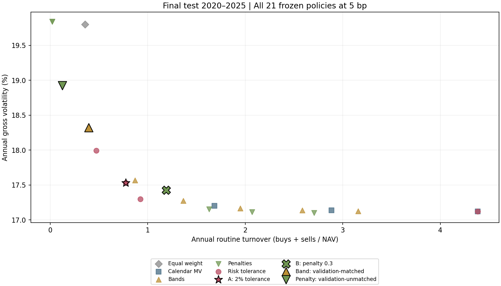
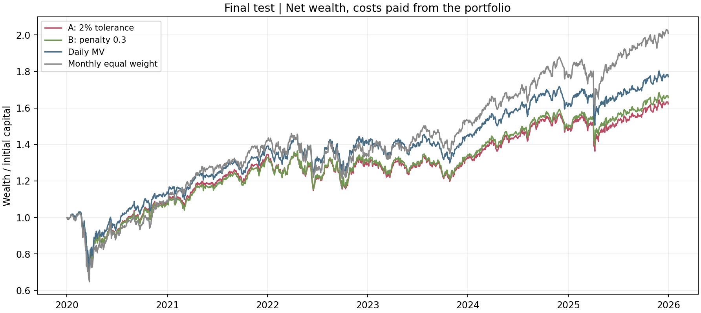
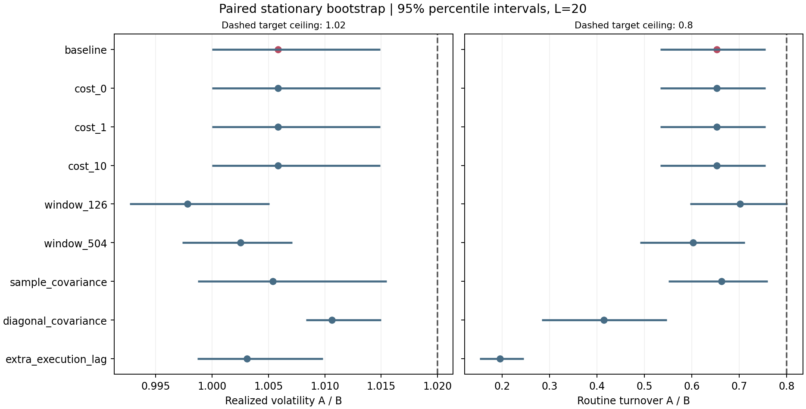
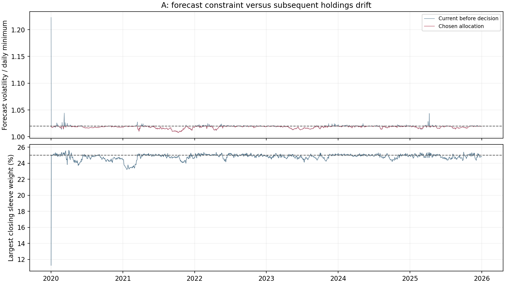
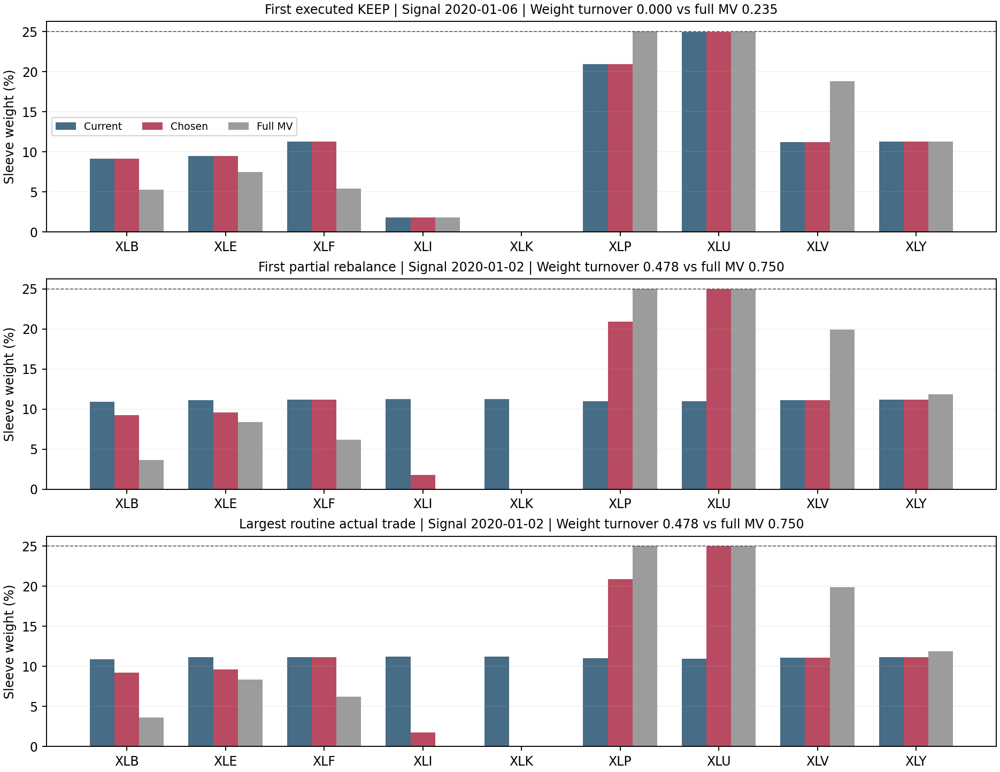

# Final evaluation

The primary comparison meets the prespecified joint criterion, classified as **Strong support** under the research protocol. Both simultaneous upper bounds satisfy the A/B ceilings of realized volatility <= 1.02 and turnover <= 0.80. Neither lower bound exceeds its ceiling, so the evidence-against flag is false. All results use the frozen settings.

The 2020–2025 final test comprises 1,508 sessions. All 21 policies completed in each of nine one-at-a-time scenarios: 189 runs and 285,012 policy-sessions. A is the 2% forecast-risk-tolerance policy. B is the validation-selected variance penalty with lambda 0.3. The secondary band 0.08 was matched on validation; penalty 1 was unmatched. No settings were selected from final outcomes.

## Primary result at 5 bp per dollar bought or sold

| Metric | A: 2% risk tolerance | B: penalty 0.3 |
|---|---:|---:|
| Annual gross volatility | 17.5290% | 17.4274% |
| Annual routine full-notional turnover | 0.7759 | 1.1893 |
| Annual net volatility | 17.5295% | 17.4281% |
| Net CAGR (252-session convention) | 8.42% | 8.79% |
| Net maximum drawdown | -32.96% | -33.14% |
| KEEP decisions | 55.31% | 7.56% |
| No discretionary trade days | 55.31% | 7.63% |
| Annual routine cost debits (bp/NAV) | 3.880 | 5.946 |

A reduced routine turnover by **34.8%**, with a **0.102 percentage-point** increase in annual gross volatility. Annual routine cost savings are **2.067 bp**. These are simulated proportional charges, not measured fills or an estimate of institutional capacity.

| Primary ratio | Point estimate | Ordinary 95% percentile interval | Target ceiling |
|---|---:|---|---:|
| Gross volatility A/B | 1.0058 | [1.0000, 1.0149] | 1.02 |
| Routine turnover A/B | 0.6524 | [0.5332, 0.7555] | 0.80 |

The interval endpoints are also the 97.5% one-sided lower/upper bounds used for the two-ratio Bonferroni decision. Paired stationary bootstrap: 5,000 replications, expected block 20 sessions, seed 20260926, PCG64. Each draw keeps both policies and their returns/turnover on the same resampled dates. [Method and reference implementation](https://bashtage.github.io/arch/bootstrap/generated/arch.bootstrap.StationaryBootstrap.html).

The bootstrap resamples recorded outcomes, conditions on the frozen policies, and does not refit covariances or simulate new trading paths. Its approximate coverage depends on time-series assumptions; structural changes and rare market episodes can limit interpretation.

## Prespecified sensitivities

| Scenario | Volatility A/B [95% interval] | Turnover A/B [95% interval] | Cost saving bp/year | Classification |
|---|---|---|---:|---|
| baseline | 1.0058 [1.0000, 1.0149] | 0.6524 [0.5332, 0.7555] | 2.067 | Strong support |
| cost_0 | 1.0058 [1.0000, 1.0149] | 0.6525 [0.5332, 0.7555] | 0.000 | Strong support |
| cost_1 | 1.0058 [1.0000, 1.0149] | 0.6525 [0.5332, 0.7555] | 0.413 | Strong support |
| cost_10 | 1.0058 [1.0000, 1.0149] | 0.6524 [0.5331, 0.7555] | 4.134 | Strong support |
| window_126 | 0.9978 [0.9927, 1.0051] | 0.7018 [0.5963, 0.8018] | 2.130 | Promising but uncertain |
| window_504 | 1.0025 [0.9974, 1.0071] | 0.6023 [0.4907, 0.7120] | 2.199 | Strong support |
| sample_covariance | 1.0054 [0.9987, 1.0155] | 0.6626 [0.5509, 0.7600] | 2.126 | Strong support |
| diagonal_covariance | 1.0106 [1.0083, 1.0150] | 0.4139 [0.2836, 0.5467] | 1.124 | Strong support |
| extra_execution_lag | 1.0031 [0.9987, 1.0098] | 0.1952 [0.1529, 0.2450] | 38.550 | Strong support |

Each scenario reruns its funded holdings path, with no Cartesian product or comparator reselection. The classification column applies the same two-ratio rule descriptively; there is no simultaneous significance claim across the robustness scenarios. Diagonal covariance changes targets and triggers together and cannot isolate a causal contribution of correlation-aware tolerance geometry.

The 126-session window is the exception to the strong-support classification: its turnover upper bound is 0.8018, just above 0.80. The reported classification remains promising but uncertain. The baseline conclusion holds at all three prespecified bootstrap block lengths.

**Delayed execution depends materially on the order-queue convention.** The frozen two-session FIFO model forms new signals from actual holdings, without projecting pending targets, and KEEP does not cancel an earlier TARGET. The comparator can therefore alternate between stale targets. An exploratory check after observing the results found that the fraction of successive filled target dollar-trade vectors with negative dot product increased from 41.6% to 99.3%. Signal/fill timing, proportional costs and frozen-target checks passed. This is consistent with queue-induced reversals; it is not a counterfactual test of projecting pending orders. The much larger cost saving in this scenario is specific to this queue model; its relevance to other execution conventions remains untested. [Exploratory ledger diagnostic](final_execution_queue_diagnostic.json).

| Baseline expected block length | Volatility ratio interval | Turnover ratio interval | Classification |
|---:|---|---|---|
| 20 | [1.0000, 1.0149] | [0.5332, 0.7555] | Strong support |
| 10 | [0.9995, 1.0144] | [0.5560, 0.7407] | Strong support |
| 60 | [1.0006, 1.0152] | [0.5086, 0.7689] | Strong support |

## Historical stability

| Period | Sessions | Volatility A/B | Turnover A/B |
|---|---:|---:|---:|
| 2020 | 253 | 1.0017 | 0.8510 |
| 2021 | 252 | 1.0095 | 0.5087 |
| 2022 | 251 | 1.0122 | 0.7244 |
| 2023 | 250 | 0.9995 | 0.3611 |
| 2024 | 252 | 1.0077 | 0.7239 |
| 2025 | 250 | 1.0176 | 0.5988 |
| 2020–2021 | 505 | 1.0024 | 0.7367 |
| 2022–2023 | 501 | 1.0088 | 0.5712 |
| 2024–2025 | 502 | 1.0145 | 0.6575 |
| Excluding 2020 | 1255 | 1.0108 | 0.5982 |
| Excluding 2021 | 1256 | 1.0056 | 0.6697 |
| Excluding 2022 | 1257 | 1.0044 | 0.6339 |
| Excluding 2023 | 1258 | 1.0063 | 0.7036 |
| Excluding 2024 | 1256 | 1.0057 | 0.6396 |
| Excluding 2025 | 1258 | 1.0045 | 0.6636 |

These effect sizes use slices of the continuous final ledger, without resetting holdings. They are descriptive checks, not additional confirmatory tests. In 2020 alone, the turnover ratio was 0.8510, missing the 20% reduction threshold. All six leave-one-year-out point comparisons met both practical thresholds; those checks do not supply new confidence bounds.

## Forecast and execution diagnostics

| Policy | Maximum chosen forecast ratio | Maximum filled-target ratio under signal covariance | Closing cap-breach days | Qualified inaccurate solver attempts |
|---|---:|---:|---:|---:|
| `weight_band_0.08` | 1.1174931 | 1.1174931 | 0 | 0 |
| `variance_penalty_0.3` | 1.0230855 | 1.0230855 | 1033 | 0 |
| `variance_penalty_1` | 1.1667634 | 1.1502164 | 12 | 0 |
| `risk_tolerant_0.02` | 1.0200000 | 1.0200000 | 465 | 333 |

All recorded tolerance decisions passed the frozen numerical risk checks, and targets passed the 25% cap check. Closing cap/risk breaches reflect subsequent drift and next-open execution, not continuous compliance. Qualified inaccurate statuses were accepted only under the pre-existing independent certificates; failed attempts that preceded a certified retry are retained in logs. There were no unresolved solver failures in these completed runs.

Epsilon-zero and daily MV have identical baseline NAV paths: maximum NAV difference $0.000000; maximum relative difference 0. Their decision rules can differ when current weights satisfy the epsilon-zero numerical tolerance.

## Prespecified decision examples

- First executed KEEP: signal 2020-01-06, due 2020-01-07; forecast ratio 1.0173 → 1.0173; chosen/full-MV weight turnover 0.0000/0.2351.
- First partial rebalance: signal 2020-01-02, due 2020-01-03; forecast ratio 1.2229 → 1.0200; chosen/full-MV weight turnover 0.4784/0.7502.
- Largest routine actual trade: signal 2020-01-02, due 2020-01-03; forecast ratio 1.2229 → 1.0200; chosen/full-MV weight turnover 0.4784/0.7502.

Dates follow the prespecified chronological/maximum-trade rules. Examples can coincide; they were not chosen for favorable subsequent returns. Cash reinvestment can occur during KEEP, so a KEEP instruction is not necessarily a zero-cost day.

## Data, verification and practical limits

No provisional values were used. The original 115 financial files and validation selection checksum are unchanged. All 189 metric sets were reconstructed from their saved ledgers; 945 genuine split events were checked for doubling shares before opening orders. Costs reconcile with full buy-plus-sell turnover. Entry costs remain in net wealth, routine turnover excludes entry, and terminal queued orders remain unfilled. Only scheduling dates extend into January 2026.

The nine 2006 disputes remain unresolved outside this test and its warmup. The snapshot is retrospective; vendor prices are not all independently replicated, ETF selection and changing sector exposures remain limitations, and fractional shares, frozen opening-price sizing, linear costs and conservative dividend availability are model assumptions. Taxes, impact, volume capacity and brokerage settlement are omitted. This study does not establish alpha, live profitability or generalization to other universes.

[All 189 policy rows and baseline diagnostics](final_all_policies.md). [Machine-readable inference](results/inference.json). [Verification](results/historical_verification.json). [Frozen implementation](../docs/final_evaluation_specification.md).
