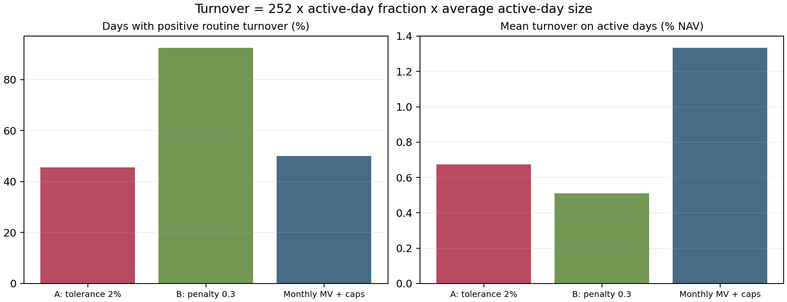
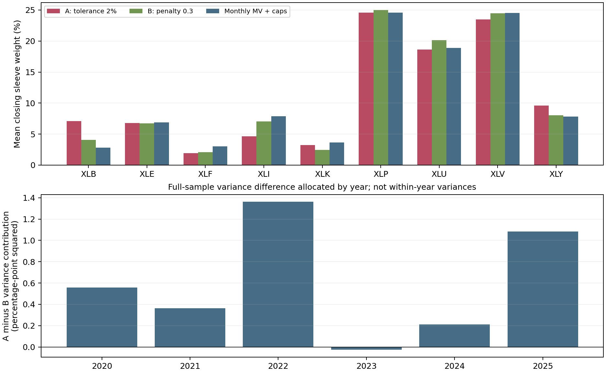

# Mechanism and sensitivity analysis

The following diagnostics were conducted after observing the final-evaluation results. They examine trading frequency, trade size, exposures and alternative comparators. The primary pair and prespecified classifications remain fixed; these additional analyses are exploratory.

## 1. Frequency, size and constraint-driven trading

A/B turnover decomposes into an active-day frequency ratio of **0.4932** and an average active-day trade-size ratio of **1.3229**; their product is **0.6524**. An active day has positive saved routine turnover, including mechanical reinvestment. This identity is descriptive; it does not identify how much performance would change under a frequency-only counterfactual policy.

| Policy | Active days / sessions | Average active-day turnover | Annual turnover |
|---|---:|---:|---:|
| risk_tolerant_0.02 | 688 / 1508 | 0.00675 | 0.7759 |
| variance_penalty_0.3 | 1395 / 1508 | 0.00510 | 1.1893 |
| minimum_variance_daily | 1507 / 1508 | 0.01741 | 4.3838 |
| minimum_variance_weekly | 1202 / 1508 | 0.01436 | 2.8846 |
| minimum_variance_monthly | 755 / 1508 | 0.01334 | 1.6835 |
| weight_band_0.08 | 334 / 1508 | 0.00709 | 0.3957 |
| variance_penalty_1 | 73 / 1508 | 0.01012 | 0.1234 |
| equal_weight_monthly | 95 / 1508 | 0.02256 | 0.3582 |

| A trigger at signal time | Signals | KEEP / TARGET | Annual filled policy turnover |
|---|---:|---:|---:|
| neither | 834 | 834 / 0 | 0.0000 |
| cap_only | 344 | 0 / 344 | 0.2333 |
| risk_only | 209 | 0 / 209 | 0.3030 |
| both | 121 | 0 / 121 | 0.2274 |

Trigger categories use the frozen numerical risk/cap tolerances. They tag a state, not the causal effect of removing a constraint. Mechanical reinvestment is outside the filled-policy column above.

| Calendar policy | Annual cap-repair turnover | Share of routine turnover |
|---|---:|---:|
| minimum_variance_daily | 0.0000 | 0.0% |
| minimum_variance_weekly | 0.5997 | 20.8% |
| minimum_variance_monthly | 0.4266 | 25.3% |

Weekly/monthly MV therefore means scheduled MV targets plus daily cap monitoring, not a pure weekly/monthly trade schedule. Any comparison to an unconstrained calendar rule would be a different experiment.

## 2. Alternative comparators

The table applies the original two-ratio criterion to fixed alternative comparators. These new intervals are exploratory and have no simultaneous coverage across comparator choices. None replaces primary B.

| Comparator | Risk A/B [95% interval] | Turnover A/B [95% interval] | Descriptive classification |
|---|---|---|---|
| minimum_variance_daily | 1.0239 [1.0097, 1.0310] | 0.1770 [0.1333, 0.2223] | Primary target not established |
| minimum_variance_weekly | 1.0228 [1.0094, 1.0299] | 0.2690 [0.2066, 0.3314] | Primary target not established |
| minimum_variance_monthly | 1.0190 [1.0060, 1.0261] | 0.4609 [0.3427, 0.6075] | Promising but uncertain |
| weight_band_0.08 | 0.9567 [0.9374, 0.9683] | 1.9608 [1.5465, 2.5957] | Primary target not established |
| variance_penalty_1 | 0.9262 [0.8991, 0.9434] | 6.2883 [3.6605, 20.0992] | Primary target not established |

No policy in the frozen 21-point grid has both no higher realized risk and no higher turnover than A, with at least one strict improvement. This finite-grid result does not establish efficiency over all possible policies. All 20 point comparisons are retained in the machine-readable result.

## 3. Concentration and market episodes

| Policy | Mean HHI | Mean effective assets | Beta to monthly equal weight | Residual annual volatility |
|---|---:|---:|---:|---:|
| risk_tolerant_0.02 | 0.1866 | 5.39 | 0.8503 | 4.88% |
| variance_penalty_0.3 | 0.2015 | 4.99 | 0.8384 | 5.31% |
| minimum_variance_daily | 0.2076 | 4.85 | 0.8207 | 5.39% |
| minimum_variance_weekly | 0.2068 | 4.87 | 0.8215 | 5.41% |
| minimum_variance_monthly | 0.2042 | 4.95 | 0.8261 | 5.33% |
| weight_band_0.08 | 0.1370 | 7.31 | 0.9132 | 2.98% |
| variance_penalty_1 | 0.1484 | 6.75 | 0.9390 | 3.54% |
| equal_weight_monthly | 0.1112 | 8.99 | 1.0000 | 0.00% |

HHI is the sum of squared sleeve weights; effective assets is its reciprocal, averaged over dates. The intercept OLS projection is descriptive exposure accounting. It is not an alpha model or causal risk adjustment. Explained plus residual variance reconciles to total sample variance in every row.

| Policy | Largest 1 / 10 squared-return share | Largest 1 / 10 turnover share |
|---|---:|---:|
| risk_tolerant_0.02 | 5.8% / 31.7% | 10.3% / 21.5% |
| variance_penalty_0.3 | 6.1% / 32.3% | 7.7% / 15.1% |

Squared-return shares use uncentered gross returns. The year-contribution figure instead uses full-sample means and the common N-1 variance denominator; its bars add exactly to the annual variance difference. It is not a plot of separately estimated yearly variance differences.

| Initial sessions omitted from continuous ledger | Risk A/B | Turnover A/B |
|---:|---:|---:|
| 21 | 1.0058 | 0.6292 |
| 63 | 1.0122 | 0.5957 |

These are descriptive slices, not new initialized backtests. The prespecified historical-stability analysis already found a 2020 turnover ratio of 0.8510, while all three two-year blocks and all leave-one-year-out point ratios meet the target. The result is not uniform in every year.

## 4. Common-state policy behavior and covariance geometry

At each of 72 calendar-month endpoints, all policies below receive A's actual holdings and the same dated covariance/reference. A's action and turnover reproduce its saved decision. These are individual decisions, not a new portfolio path; B and the band need not choose the same forecast risk as A.

| Common-state policy | KEEP states / 72 | Median L1 trade | Median forecast volatility / minimum |
|---|---:|---:|---:|
| A | 44 / 72 | 0.00000 | 1.01898 |
| B | 0 / 72 | 0.02576 | 1.01389 |
| band | 24 / 72 | 0.00434 | 1.01875 |
| full_MV | 0 / 72 | 0.26711 | 1.00000 |

A issues KEEP while B trades in **44** states and while the selected 8 pp band trades in **23** states. This shows different triggers even at identical starting holdings. It does not establish that the avoided trades are economically unnecessary or that the methods target identical risk.

The plane passes through the recorded current, chosen and full-MV allocations at the first partial rebalance. Its axes are coefficients on two allocation directions, not individual ETF weights. Shaded regions compare a portfolio-level covariance constraint with per-asset weight bands inside the same feasible set. This illustration does not identify a causal performance benefit of correlations. The prespecified diagonal ablation changes targets and triggers together, and its strong result is not evidence that full covariance information is necessary for the observed primary trade-off.

## 5. Leakage and failure checks

All **6** historical-window perturbation pairs preserve every earlier daily ledger, economic decision field and executed trade exactly, while the future paths change. The 2020 checks span market turbulence; the 2025 cutoff precedes genuine splits. These reset-window diagnostics test causality of information flow, not strategy performance. Saved paired ledgers make the check inspectable.

The full regression suite and its earlier synthetic leakage tests are recorded separately. The final-evaluation solver diagnostics retain certified inaccurate attempts and no unresolved solver failures. Those checks do not establish perfect data quality or institutional execution realism.

## 6. Interpretation

The frozen A/B finding retains its original uncertainty statement and the 2.067 bp/year saving under 5 bp linear costs. Comparisons with other policies are less conclusive. Trading frequency, trade size, cap monitoring and concentration describe the observed behavior; these analyses do not isolate their causal contributions.

The results do not establish uniform benefits across years, a unique contribution from correlation information, dominance over other policies, return outperformance or robustness to realistic execution delays. The 126-day turnover upper bound is 0.8018, and 2020 alone misses the point turnover criterion. The lag-two saving depends on a FIFO queue that ignores pending targets; a policy that accounts for pending orders has not been evaluated.

Nine 2006 cash amounts remain unresolved in provisional development. They are outside the reviewed validation and final input windows.

All new checks are exploratory. The nine predeclared sensitivities, L=10/20/60 baseline intervals and fixed-year stability checks remain in [the frozen final report](final_evaluation.md). [Complete review results](results/mechanisms.json) preserve the evidence.
