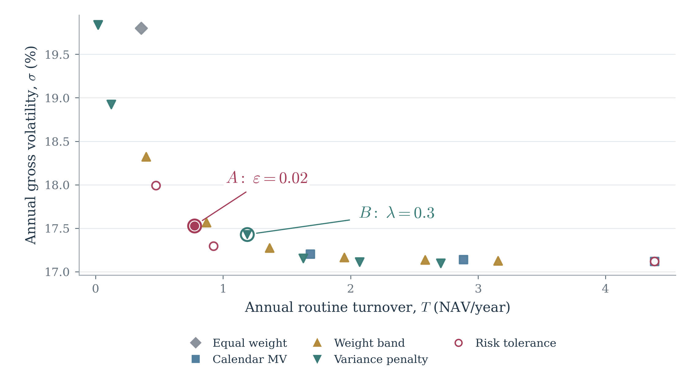
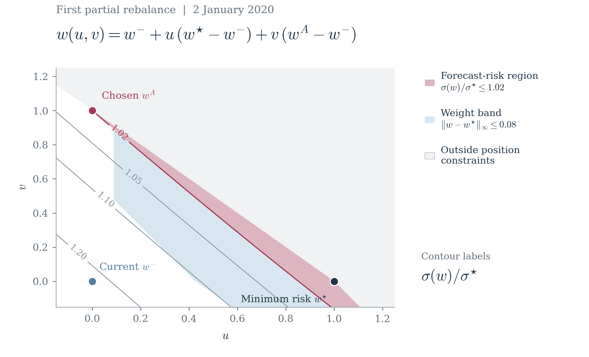

# Forecast-Risk Tolerance and Portfolio Rebalancing

**Jay (Shijie) Jiang | September 2026**

An empirical study of partial rebalancing in nine US sector ETFs

## Abstract

This study tests whether a small forecast-risk tolerance can reduce portfolio turnover at similar realized risk. I compare a minimum-turnover policy constrained to remain within 2% of forecast minimum volatility with conventional calendar, weight-band and variance-penalty policies. The research design fixes the proposed tolerance before analysis and selects the primary comparator using 2015-2019 validation data. In the frozen 2020-2025 evaluation, the proposed policy reduces turnover by **34.8%**, with annual gross volatility of **17.53% versus 17.43%**. The paired bootstrap meets the prespecified practical criterion of at least 20% less turnover with at most 2% higher relative realized volatility. Absolute savings are modest: **2.07 basis points per year** at an assumed cost of 5 basis points per dollar traded. The monthly-rebalancing comparison and shorter estimation window are less conclusive. The delayed-execution result depends on the order queue. The study documents the implementation and the conditions under which lower turnover is accompanied by similar realized risk.

## Main finding

| Final test: 2020-2025 | Risk tolerance A | Frozen comparator B |
|---|---:|---:|
| Annual gross volatility | 17.53% | 17.43% |
| Annual full-notional turnover | 0.776 | 1.189 |
| Annual routine cost debit, bp/NAV | 3.88 | 5.95 |
| Net CAGR | 8.42% | 8.79% |
| Net maximum drawdown | -32.96% | -33.14% |

Table 1. A uses a 2% forecast-volatility tolerance; B is the validation-selected variance penalty with $\lambda=0.3$. Costs are simulated at 5 bp per dollar bought or sold. Turnover includes both purchases and sales, excluding initial entry; entry costs remain in net wealth. CAGR uses 252 sessions per year.

## Research design

The universe is XLB, XLE, XLF, XLI, XLK, XLP, XLU, XLV and XLY. Targets are long-only, fully invested within the ETF sleeve and capped at 25% per fund. The baseline risk model is Ledoit-Wolf shrinkage [2] on 252 trailing total-return observations. There is no expected-return model.

Development covers 2005-2014, validation 2015-2019, and final evaluation 2020-2025. All 21 policy settings and the primary pair are frozen before final outcomes. The final block contains 1,508 sessions; each block begins with USD 1 million and an equal-weight purchase. Nine 2006 cash-dividend amounts remain unresolved in provisional development. Validation and final evaluation use separately reviewed histories and require no substitutions.

<!-- page -->

## 1. Policy and implementation

Let $w_t^-$ be the actual ETF weights after market drift, normalized within the ETF sleeve. Using only returns observed through the decision close, compute the common minimum-variance reference:

$$
\mathcal{C}=\{w:\mathbf{1}^{\top}w=1,\ 0\leq w_i\leq0.25\},\qquad v_t^*=\min_{w\in\mathcal{C}}\;w^{\top}\widehat{\Sigma}_t w.
$$

The proposed policy minimizes weight turnover subject to a relative forecast-volatility budget:

$$
\min_{w\in\mathcal{C}}\;\|w-w_t^-\|_1\quad\mathrm{subject\ to}\quad w^{\top}\widehat{\Sigma}_t w\leq(1+0.02)^2v_t^*.
$$

If current weights are feasible, their zero-turnover objective is optimal: issue KEEP. Otherwise, issue the computed partial TARGET. Positive semidefinite covariance makes the problem convex. Nonunique primary solutions use the frozen distance-to-current-weights tie-break within certified numerical tolerances. CVXPY/Clarabel solutions undergo independent feasibility and objective checks; unresolved failures stop a run rather than becoming KEEP.

### Comparator selection

The penalty family solves normalized variance plus $\lambda$ times $L_1$ turnover. Its primary comparator uses $\lambda=0.3$:

$$
\min_{w\in\mathcal{C}}\;\frac{w^{\top}\widehat{\Sigma}_t w}{v_t^*}+0.3\|w-w_t^-\|_1.
$$

On validation, retain conventional policies with gross volatility no more than 1.02 times daily minimum variance; select the one with lowest turnover using frozen tie-breaks. Equal weight is an allocation reference, not a selection candidate. This selects B before final evaluation. The 21-policy grid includes three calendar MV rules, six partial-band widths, seven penalty strengths, four tolerances and monthly equal weight.

The constrained and penalized formulations are related through convex duality: a suitable state-dependent penalty can support a constrained solution under regularity conditions. The experiment compares fixed policy parameterizations within the established convex risk-and-cost framework [1].

### From a signal to a funded trade

Choose targets after close $t$ and fill at open $t+1$, without refitting the signal. For opening ETF dollar holdings $a$, settled cash $C$, target $w$ and cost $c$, solve for post-cost ETF wealth $S$:

$$
S+c\sum_i|w_iS-a_i|=\sum_i a_i+C.
$$

Set shares to target weight times $S$ divided by the nominal opening price. This funds costs from the portfolio [3]. Cash dividends accrue as receivables on the ex-date, settle after the pay-date close and become usable at the next open. Genuine splits change share units; they do not create returns. Gross returns remove explicit cost debits from the same funded exposure path. Cash and receivables remain in total NAV but outside the sleeve-risk constraint. Daily cap monitoring applies to calendar rules too; later price drift can breach a target cap before the next fill.

<!-- page -->

## 2. Out-of-sample risk and turnover

Figure 1. All 21 baseline policies, without selecting a test-sample winner. Band $b=0.08$ was matched to A's turnover on validation; secondary penalty $\lambda=1$ was the nearest available but unmatched setting. Neither label implies a turnover match in the final period. Calendar policies include daily cap monitoring.

| Primary quantity | Estimate | Ordinary 95% interval | Ceiling |
|---|---:|---|---:|
| Gross volatility A/B | 1.0058 | [0.999988, 1.014907] | 1.02 |
| Routine turnover A/B | 0.6524 | [0.5332, 0.7555] | 0.80 |

Table 2. Paired stationary bootstrap, 5,000 replications, expected block length 20. The 97.5th percentile is also the one-sided upper endpoint used for each of the two Bonferroni-adjusted primary inequalities. The volatility lower endpoint is slightly below one before rounding.

Both upper bounds satisfy the fixed thresholds under the bootstrap assumptions. The criterion allows a limited risk increase; it does not establish equal risk or superiority to other policies. A trades 34.8% less than B, while realized volatility rises by 0.102 percentage points (0.583% relatively). The result survives baseline block lengths 10 and 60.

The full grid shows the price of that saving. Daily MV has 17.12% volatility and 4.384 annual turnover; monthly MV has 17.20% and 1.684. A accepts higher realized risk while trading less. Exploratory comparison with monthly MV gives risk ratio 1.0190, interval [1.0060, 1.0261], and turnover ratio 0.4609. Its risk upper bound exceeds 1.02, so the interval does not confirm the risk ceiling. Against daily and weekly MV, the risk point estimates themselves exceed 1.02. The primary result is comparator-dependent.

At 5 bp, the annual routine debit falls from 5.95 to 3.88 bp/NAV. The absolute benefit is small. Net CAGR is lower for A (8.42% versus 8.79%); the project targets implementation efficiency at similar risk, not return outperformance. Risk, turnover and net outcomes are all retained in the supporting report.

<!-- page -->

## 3. Robustness and uncertainty

| Scenario | Volatility A/B [95% CI] | Turnover A/B [95% CI] | Saving, bp |
|---|---|---|---:|
| Baseline (5 bp) | 1.0058 [1.0000, 1.0149] | 0.6524 [0.5332, 0.7555] | 2.07 |
| Zero cost | 1.0058 [1.0000, 1.0149] | 0.6525 [0.5332, 0.7555] | 0.00 |
| 1 bp cost | 1.0058 [1.0000, 1.0149] | 0.6525 [0.5332, 0.7555] | 0.41 |
| 10 bp cost | 1.0058 [1.0000, 1.0149] | 0.6524 [0.5331, 0.7555] | 4.13 |
| 126-day window | 0.9978 [0.9927, 1.0051] | 0.7018 [0.5963, 0.8018] | 2.13 |
| 504-day window | 1.0025 [0.9974, 1.0071] | 0.6023 [0.4907, 0.7120] | 2.20 |
| Sample covariance | 1.0054 [0.9987, 1.0155] | 0.6626 [0.5509, 0.7600] | 2.13 |
| Diagonal covariance | 1.0106 [1.0083, 1.0150] | 0.4139 [0.2836, 0.5467] | 1.12 |
| Two-session FIFO | 1.0031 [0.9987, 1.0098] | 0.1952 [0.1529, 0.2450] | 38.55 |

Table 3. Frozen A/B parameters in nine separate scenarios. Brackets contain ordinary 95% percentile intervals; expected block length is 20. Cost saving is bp/year. Both upper bounds meet the practical thresholds in eight scenarios; the 126-day case misses. There is no simultaneous significance claim across scenarios. Full ledgers were rerun for each scenario, including cost changes.

### Where the conclusion is weaker

With 126 trailing observations, the turnover upper bound is 0.8018, slightly above 0.80, so this scenario misses the joint criterion. In 2020 alone, turnover A/B is 0.8510, missing the 20% reduction threshold. All three fixed two-year blocks and all six leave-one-year-out point comparisons meet both thresholds. These are descriptive slices of the continuous ledger, not newly initialized strategies or extra confirmatory tests.

### Execution delay exposes a queue limitation

The two-session FIFO convention forms new signals from actual holdings without projecting pending targets. KEEP does not cancel an earlier TARGET. In an exploratory diagnostic prompted by the large delayed-execution saving, the share of successive comparator trade vectors with negative dot product rises from 41.59% to 99.27%. Timing, frozen-target and cost checks pass. The reversals are consistent with the stale-target queue, but no counterfactual pending-order-aware policy was tested. The 38.55 bp saving is conditional on this queue model, not evidence of general robustness to latency.

### Inference assumptions

The stationary bootstrap jointly samples A/B gross returns and turnover on the same dates, continuing circularly with probability $1-1/L$ and restarting uniformly with probability $1/L$ [4]. Seed 20260926 and PCG64 fix 5,000 draws. The baseline uses $L=20$; lengths 10 and 60 provide prespecified checks. Both one-sided upper bounds have nominal 95% joint coverage through a Bonferroni adjustment, subject to bootstrap validity.

This procedure conditions on recorded outcomes and frozen policies. It does not refit covariances, regenerate trading paths, correct data mining or remove regime dependence. The diagonal-covariance sensitivity changes both targets and triggers, so it does not isolate a causal benefit from correlation-aware tolerance geometry.

<!-- page -->

## 4. Trading decisions and mechanisms

Figure 2. Exploratory slice at the first partial rebalance. Current $w^-$ is at $(0,0)$, minimum-variance $w^\star$ at $(1,0)$, and chosen $w^A$ at $(0,1)$ in the displayed plane. Pink marks the 2% risk region, blue the 8-percentage-point weight band, and gray infeasible weights. Here $\sigma^\star$ denotes minimum forecast volatility. This is a slice of the nine-asset feasible set.

On 6 January 2020, current forecast volatility is 1.0173 times the minimum. The holdings already satisfy the 1.02 ceiling: KEEP avoids a full-MV weight turnover of 0.2351. On 2 January, the ratio is 1.2229; a partial rebalance reduces it to 1.0200, with weight turnover 0.4784 rather than 0.7502 for full MV. The first partial trade is also the largest routine fill. Decision-time weight distances differ from opening dollar turnover.

Exploratory analysis decomposes the saving: A has 50.7% fewer active trading days than B, but 32.3% larger turnover on an active day. Mean concentration (sum of squared weights) is 0.1866 versus 0.2015. Across 72 shared month-end states, A chooses KEEP 44 times, versus zero for B and 24 for the band. These descriptive checks support different trading triggers, without proving a causal benefit from covariance geometry.

All saved tolerance decisions pass the frozen risk checks. For A, 465 closing sessions exceed the 25% cap after market drift; these are not target violations. 333 solver attempts with qualified inaccurate status pass the pre-existing independent certificates. No unresolved solver failures occur. $\varepsilon=0$ and daily MV have identical baseline NAV paths. KEEP may still involve mechanical cash reinvestment and its costs.

<!-- page -->

## 5. Limits, provenance and reproducibility

### Interpretation

A fixed 2% forecast-risk tolerance provides a favorable realized risk-turnover trade-off relative to the frozen primary comparator on this ETF sample, with small absolute cost savings. It is a one-step rebalancing policy. It does not establish persistent alpha, live profitability, optimal dynamic control or execution capacity. Increased tolerance reduces minimum trading for a fixed state; path dependence prevents an automatic monotonicity claim for cumulative turnover.

### Data and model boundaries

The nine-ETF universe is deliberately selected and does not reconstruct historical stock constituents or today's complete sector structure. Fund exposures change. Yahoo prices and issuer/distributor action evidence are retrospective snapshots, not point-in-time publication archives; prices are not independently replicated in full. Data QA inspected the entire historical sample before final strategy evaluation, so "held out" refers to policy outcomes in this workflow, not previously unknown market history.

Nine September 2006 cash amounts remain unresolved. Earlier development uses provisional scenarios; validation and final inputs exclude those events and reset holdings. The final window includes 2017-2019 risk warmup and 2020-2025 trades. A January 2026 calendar buffer schedules unfilled terminal orders; it supplies no future returns. Reconciled source data could resolve the development discrepancies; any resulting strategy changes would require exploratory evaluation.

Opening-price target sizing, fractional shares, linear costs and conservative dividend availability are assumptions. Taxes, volume-dependent impact, capacity and brokerage settlement are omitted. The sleeve constraint does not cover cash or distributed auxiliary assets. The delayed-execution result depends on the FIFO queue in Section 3.

### Audit trail and reproduction

The study contains 189 runs and 285,012 policy-sessions. Five genuine split events were verified in each run, giving 945 event checks. Six historical future-data perturbation pairs preserve earlier decisions and ledgers. All aggregate metrics were reconstructed from saved ledgers; input and selection hashes record the evaluated data and policies.

From the repository root, `python scripts/reproduce.py check` runs the data-free tests and integrity checks; `python scripts/reproduce.py demo` runs the synthetic example. Financial replay requires the five reviewed input snapshots, which are not distributed. `python scripts/reproduce.py full --data-dir PATH` reruns all 189 configurations and compares aggregate metrics and bootstrap summaries. See [reproducibility](../docs/reproducibility.md) and [data availability](../docs/data_availability.md) for the input requirements and verification scope.

### References

[1] Boyd, S., et al. (2017). [Multi-Period Trading via Convex Optimization](https://web.stanford.edu/~boyd/papers/cvx_portfolio.html). Foundations and Trends in Optimization, 3(1), 1-76.

[2] scikit-learn. [LedoitWolf estimator documentation](https://scikit-learn.org/stable/modules/generated/sklearn.covariance.LedoitWolf.html). The estimator version is pinned in the dependency file.

[3] MOSEK. [Portfolio Optimization Cookbook: Transaction costs](https://docs.mosek.com/portfolio-cookbook/transaction.html). Self-financing treatment of transaction costs.

[4] arch. [StationaryBootstrap documentation](https://bashtage.github.io/arch/bootstrap/generated/arch.bootstrap.StationaryBootstrap.html). Stationary-bootstrap mechanism. This project implements the sampler locally and records its random-index checksum.
